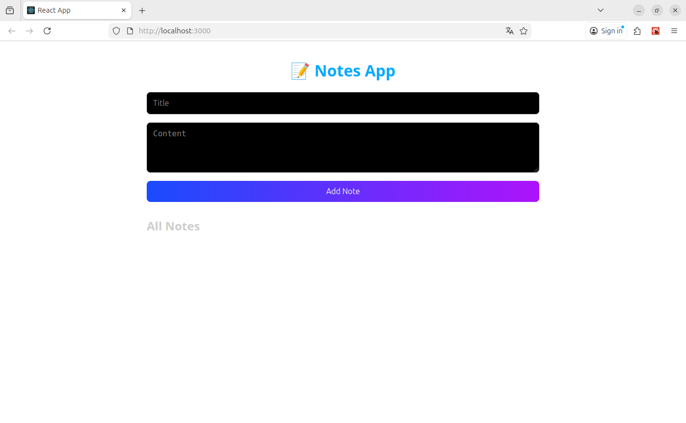
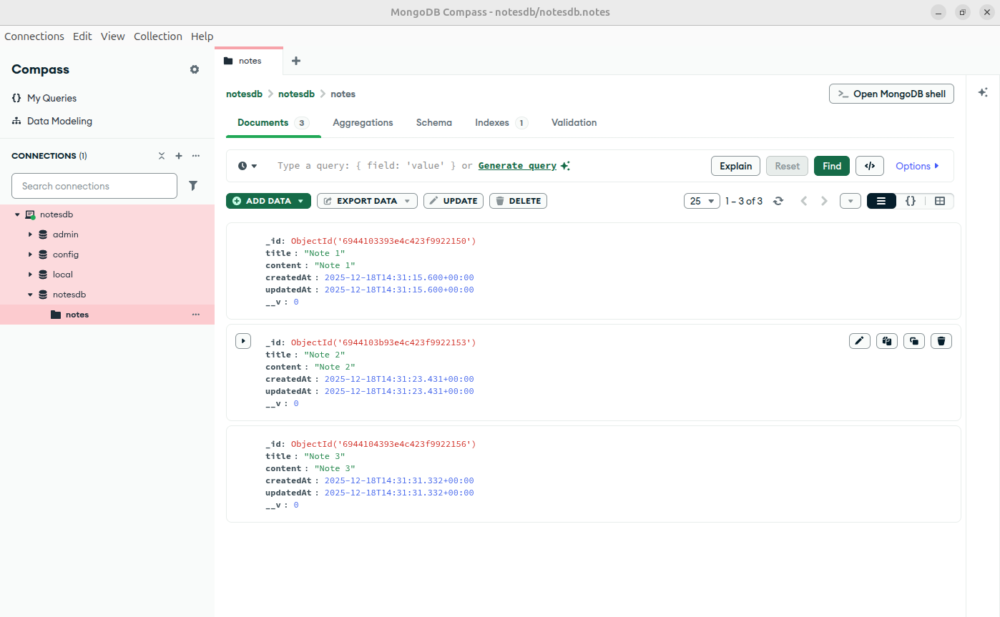

# 📝 Notes App - MERN Stack Tutorial

A simple and beginner-friendly full-stack application built with 
**React.js**, **Node.js**, **Express.js**, and **MongoDB**. This project 
demonstrates how to connect a frontend React app with a backend 
Node.js/Express server and a MongoDB database.

---

## 🧰 Tech Stack

- **Frontend**: React.js, Axios, Styled Components, React Icons
- **Backend**: Node.js, Express.js
- **Database**: MongoDB (with Mongoose ODM)
- **Tools**: MongoDB Compass GUI

---

## 📁 Folder Structure

```
project-root/
│
├── backend/
│   ├── config/
│   │   └── db.js
│   ├── models/
│   │   └── Note.js
│   ├── routes/
│   │   └── notes.js
│   ├── server.js
│
├── frontend/
│   ├── src/
│   │   ├── components/
│   │   └── App.js
```

---

## 🚀 Setup Instructions

### 1. Backend Setup

```bash
mkdir backend
cd backend
npm init -y
npm install express mongoose cors dotenv
```

#### Create MongoDB Connection (`config/db.js`)

```js
const mongoose = require("mongoose");

const connectDB = async (url) => {
  try {
    await mongoose.connect(url);
    console.log("✅ MongoDB Connected");
  } catch (error) {
    console.error("❌ MongoDB connection error:", error.message);
    process.exit(1);
  }
};

module.exports = connectDB;
```

#### Define Mongoose Model (`models/Note.js`)

```js
const mongoose = require("mongoose");

const NoteSchema = new mongoose.Schema({
  title: {
    type: String,
    required: true,
  },
  content: {
    type: String,
    required: true,
  },
}, {
  timestamps: true,
});

module.exports = mongoose.model("Note", NoteSchema);
```

#### API Routes (`routes/notes.js`)

```js
const express = require("express");
const router = express.Router();
const Note = require("../models/Note");

// Get all notes
router.get("/", async (req, res) => {
  try {
    const notes = await Note.find();
    res.json(notes);
  } catch (err) {
    res.status(500).json({ message: err.message });
  }
});

// Create a note
router.post("/", async (req, res) => {
  try {
    const note = new Note(req.body);
    await note.save();
    res.status(201).json(note);
  } catch (err) {
    res.status(400).json({ message: err.message });
  }
});

// Update a note
router.put("/:id", async (req, res) => {
  try {
    const note = await Note.findByIdAndUpdate(req.params.id, req.body, { 
new: true });
    res.json(note);
  } catch (err) {
    res.status(400).json({ message: err.message });
  }
});

// Delete a note
router.delete("/:id", async (req, res) => {
  try {
    await Note.findByIdAndDelete(req.params.id);
    res.json({ message: "Note deleted" });
  } catch (err) {
    res.status(500).json({ message: err.message });
  }
});

module.exports = router;
```

#### Server Entry Point (`server.js`)

```js
const express = require("express");
const cors = require("cors");
const dotenv = require("dotenv");

const connectDB = require("./config/db");
const notesRoutes = require("./routes/notes");

dotenv.config();

const app = express();

const connection_url = process.env.MONGO_URI || 
"mongodb://localhost:27017/notesdb";

connectDB(connection_url);

app.use(cors());
app.use(express.json());

app.use("/api/notes", notesRoutes);

const PORT = process.env.PORT || 5000;
app.listen(PORT, () => console.log(`🚀 Server running on port ${PORT}`));
```

---

### 2. Frontend Setup

```bash
npx create-react-app frontend
cd frontend
npm install axios styled-components react-icons
```

#### App.js (Frontend Main Component)

```jsx
import React, { useEffect, useState } from "react";
import axios from "axios";
import styled from "styled-components";
import { FaEdit, FaTrash } from "react-icons/fa";

const Container = styled.div`
  max-width: 800px;
  margin: auto;
  padding: 1rem;
  font-family: "Segoe UI", Tahoma, Geneva, Verdana, sans-serif;
  color: #fff;
  min-height: 100vh;
`;

const Title = styled.h1`
  text-align: center;
  color: #00aaff;
`;

const Form = styled.div`
  display: flex;
  flex-direction: column;
  gap: 1rem;
  margin-bottom: 2rem;
`;

const Input = styled.input`
  padding: 0.75rem;
  font-size: 1rem;
  border: none;
  border-radius: 8px;
  background: black;
  border: 1px solid #353535;
  color: white;
  &:focus {
    border-color: #3f51ff;
    outline: none;
  }
`;

const TextArea = styled.textarea`
  padding: 0.75rem;
  font-size: 1rem;
  border: none;
  border-radius: 8px;
  background: black;
  border: 1px solid #353535;
  color: white;
  &:focus {
    border-color: #3f51ff;
    outline: none;
  }
`;

const Button = styled.button`
  padding: 0.75rem 1rem;
  background: #00aaff;
  color: white;
  border: none;
  border-radius: 4px;
  cursor: pointer;
`;

const NoteGrid = styled.div`
  display: grid;
  grid-template-columns: repeat(auto-fill, minmax(300px, 1fr));
  gap: 1rem;
`;

const NoteCard = styled.div`
  background: #222;
  padding: 1rem;
  border-radius: 8px;
  color: #ccc;
`;

const App = () => {
  const [notes, setNotes] = useState([]);
  const [form, setForm] = useState({ title: "", content: "" });
  const [editingId, setEditingId] = useState(null);

  const fetchNotes = async () => {
    const res = await axios.get("/api/notes");
    setNotes(res.data);
  };

  const addOrUpdateNote = async () => {
    try {
      if (editingId) {
        await axios.put(`/api/notes/${editingId}`, form);
        setEditingId(null);
      } else {
        await axios.post("/api/notes", form);
      }
      setForm({ title: "", content: "" });
      fetchNotes();
    } catch (error) {
      console.error("Error:", error);
    }
  };

  const deleteNote = async (id) => {
    try {
      await axios.delete(`/api/notes/${id}`);
      fetchNotes();
    } catch (error) {
      console.error("Error:", error);
    }
  };

  const editNote = (note) => {
    setForm({ title: note.title, content: note.content });
    setEditingId(note._id);
  };

  useEffect(() => {
    fetchNotes();
  }, []);

  return (
    <Container>
      <Title>📝 Notes App</Title>
      <Form>
        <Input
          type="text"
          placeholder="Title"
          value={form.title}
          onChange={(e) => setForm({ ...form, title: e.target.value })}
        />
        <TextArea
          placeholder="Content"
          rows={4}
          value={form.content}
          onChange={(e) => setForm({ ...form, content: e.target.value })}
        />
        <Button onClick={addOrUpdateNote}>
          {editingId ? "Update Note" : "Add Note"}
        </Button>
      </Form>

      <h2 style={{ color: "#ccc" }}>All Notes</h2>
      <NoteGrid>
        {notes.map((note) => (
          <NoteCard key={note._id}>
            <h3>{note.title}</h3>
            <p>{note.content}</p>
            <div style={{ marginTop: "10px" }}>
              <button onClick={() => editNote(note)} style={{ marginRight: 
"10px" }}>
                <FaEdit /> Edit
              </button>
              <button onClick={() => deleteNote(note._id)}>
                <FaTrash /> Delete
              </button>
            </div>
          </NoteCard>
        ))}
      </NoteGrid>
    </Container>
  );
};

export default App;
```

---

## 🧪 Running the App

### Run Backend

```bash
cd backend
node server.js
```

### Run Frontend

```bash
cd frontend
npm start
```

---

## 🛠️ Using MongoDB Compass

To manage your database visually:

1. Install [MongoDB 
Compass](https://www.mongodb.com/try/download/compass).
2. Connect to 
`mongodb://localhost:27017/`.
3. Create a new database named `notesdb` and a collection named `notes`.
4. You can now view and edit data directly in the GUI.

---

## 📷 Screenshots

### 🖼️ Main App UI



### 🖼️ MongoDB Compass



---

## ✅ Features

- ✅ Add, edit, and delete notes
- ✅ Full CRUD operations
- ✅ Responsive UI
- ✅ MongoDB integration with Compass GUI

---

## 📌 Future Enhancements

- Add user authentication
- Implement search functionality
- Add note categories/tags
- Deploy to cloud (e.g., Vercel, Heroku)

---

## 📬 License

MIT

---

## 🙏 Acknowledgments

- Built using [React.js](https://reactjs.org/)
- Powered by [Node.js](https://nodejs.org/) and 
[Express.js](https://expressjs.com/)
- Managed with [MongoDB](https://www.mongodb.com/) and [MongoDB 
Compass](https://www.mongodb.com/products/compass)

---

> 📝 Made with ❤️ for developers learning full-stack development with MERN!